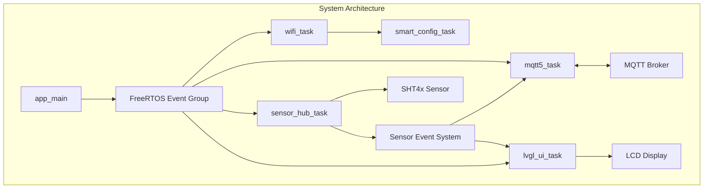
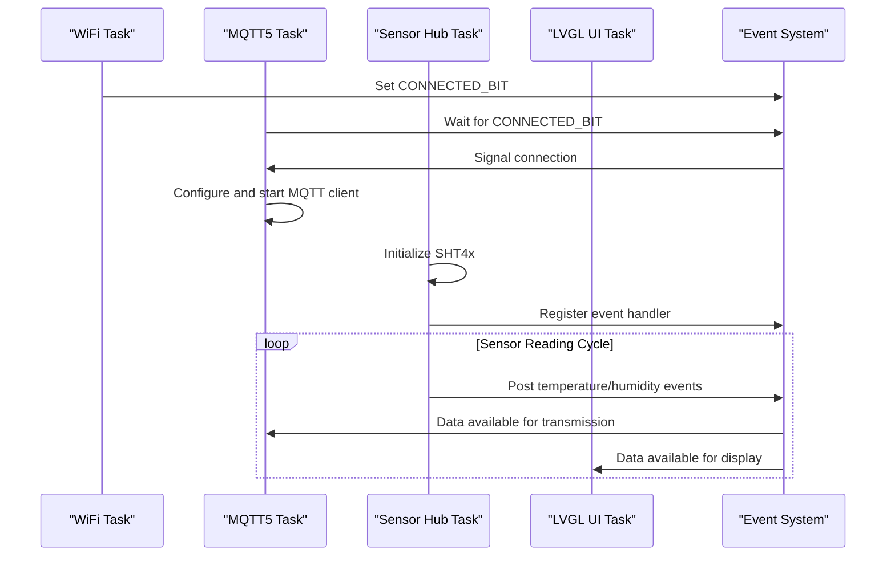

# iot_sensor
 [](https://deepwiki.com/jeongyeham/iot_sensor)

An ESP32-S3 based IoT sensor system using MQTT5 protocol for communication, supporting temperature and humidity monitoring with data visualization.

## Project Overview

This project is a complete IoT sensor solution built on the ESP32-S3 microcontroller, integrating an SHT4x temperature and humidity sensor, transmitting data to the cloud via MQTT5 protocol, and featuring an LVGL graphical interface display.

## Key Features

- **Temperature & Humidity Monitoring**: Real-time environmental monitoring using SHT4x sensor
- **MQTT5 Communication**: Support for advanced MQTT5 protocol features including user properties, enhanced error reporting, and flexible message handling
- **WiFi Connectivity**: SmartConfig network configuration and automatic reconnection
- **LVGL Graphical Interface**: Data visualization on a 120x120 LCD display (ST7789 driver)
- **FreeRTOS Multi-tasking**: Parallel processing with FreeRTOS task architecture

## System Architecture

The system is built on a modular, task-based architecture using FreeRTOS, where different components run as separate tasks:



### Task Communication

The system uses FreeRTOS event groups for inter-task communication:



## Hardware Requirements

- ESP32-S3 development board
- SHT4x temperature and humidity sensor
- 120x120 LCD display (ST7789 driver)
- Power adapter

## Software Dependencies

- ESP-IDF (Espressif IoT Development Framework)
- FreeRTOS
- LVGL graphics library
- ESP MQTT client library

## Quick Start

### Environment Setup

1. Install ESP-IDF development environment
2. Clone this repository
3. Configure the project

### Build and Flash

```bash
idf.py build
idf.py -p [PORT] flash
```

### Monitor Output

```bash
idf.py -p [PORT] monitor
```

## Project Structure

```
iot_sensor/
├── components/               # Components directory
│   ├── mqtt5/               # MQTT5 protocol implementation
│   │   ├── include/
│   │   │   └── mqtt5.h
│   │   └── mqtt5.c
│   └── sht4x/               # SHT4x sensor driver
│       ├── include/
│       │   └── sht4x.h
│       └── sht4x.c
├── main/                    # Main program
│   ├── app_main.c           # Application entry
│   ├── freertos_task.c      # FreeRTOS task implementation
│   └── freertos_task.h      # Task declarations
└── README.md                # Project documentation
```

## Implementation Details

### Main Components

1. **WiFi Task**: Handles network connection and management
   - Initializes WiFi in station mode
   - Retrieves stored WiFi configuration from NVS or starts SmartConfig
   - Manages connection events and reconnection

2. **MQTT5 Task**: Manages MQTT communication
   - Waits for WiFi connection before initializing
   - Configures MQTT5 client with advanced properties
   - Publishes sensor data and subscribes to control topics
   - Handles MQTT events (connection, disconnection, data, errors)

3. **Sensor Hub Task**: Manages the SHT4x sensor
   - Configures I2C communication bus
   - Initializes and starts the SHT4x sensor
   - Creates sensor event loop and registers event handlers
   - Processes temperature and humidity readings

4. **LVGL UI Task**: Manages the display interface
   - Initializes the LCD display (ST7789)
   - Configures LVGL graphics library
   - Renders sensor data and system status

### MQTT5 Features

The system leverages advanced MQTT5 protocol features:

- User Properties (custom key-value pairs)
- Session Expiry Interval
- Message Expiry Interval
- Will Message (sent when client disconnects unexpectedly)
- Response Topic
- Shared Subscription

### Sensor Operation

The SHT4x sensor supports multiple measurement modes:

- High Precision Mode
- Medium Precision Mode
- Low Precision Mode
- Various heater options for condensation prevention

## Developer

- Jeong Yeham (@jeongyeham)

## License

This project is licensed under the Apache-2.0 License. See the LICENSE file for details.

## Contributing

Contributions via Issues and Pull Requests are welcome. Please ensure your code adheres to the project's coding standards before submitting a PR.
